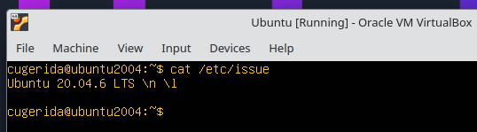
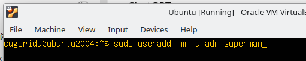
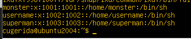

## Part 1. Isntalling the Operating System.

Ubuntu 20.04 Server LTS was installed on a virtual machine using VirtualBox.
The operating system was installed without a graphical user interface (GUI).
To veryfy the installed version of Ubuntu, the following command was executed: "cat /ect/issue".

## Part 2. Creating a New User.
A new user was created that is different from the user created during OS instalation.
The new user was added to the adm group to the grant administrative privileges.
The user was created using the following command: "sudo useradd -m -G adm username".

To verify that the user exists in the system, the following comand was used: "cat /etc/passwd".

## Part 3.
## Part 3.1. OS Network and System COnfiguration.
3.1 Hostname. 
In order to see current hostname I use the following command: "hostnamectl".
The hostnamen was changen by using the command:"sudo hostnamectl set-hostname mzsubuntu". 

The system hostname has been changed to mzsubuntu.

## 3.2 Timezone
The current time and date was cheched by using this command "timedatectl".
By using this command: "sudo timedatectl set-timezone Asia/Tashknt" and verify by using "timedatectl".

## 3.3 Network Inerfaces
TO see all available network interfaces on the Ubuntu 20.04, I gave the following comand: "ip link show".
lo - loopback interface used for internal communication within the machine.
enp0s3 - physical or virtual interface used to connect to external networks 

## 3.4 Obtain IP from DHCP
 The task was obtain IP address from DHCP server when I gave command sudo dhclient in shows "File exists" cuse I accidently skip the 3rd point and allready done with netplan. And when I gave command "ip route show" it shows the IP from DHCP.

## 3.5 Id Gateway IP addresses
Based on the command "ip route show" internal gateway was shown (10.201.175.254.)
In order to find etxernal IP I used command "curl ifconfig.me"

## 3.6 Static Network Configuration (Netplan)
Edited /etc/netplan/00-installer-config.yaml using nano.
Disabled DHCP and added static settings: 192.168.1.10, GW 10.201.175.254, DNS 1.1.1.1.
Applied changes with sudo netplan apply.
Verified with ip addr and ip route show.

## 3.7 Reboot and Ping
Restarted the system using the sudo reboot command. Performed a connectivity test to a public IP using ping -c 4 1.1.1.1. Verified DNS resolution by pinging a domain name: ping -c 4 ya.ru. Both tests resulted in 0% packet loss, confirming that the static IP, gateway, and DNS are functioning correctly after reboot.

## Part 4. OS Updte

By using this command "sudo apt update" I connected to the official repositories and download the latest information about available software and their  versions. It synchronizes the local package index with the remote sources. After I gave this command "sudo apt upgrade -y" this command will install the new version based on the previous updated list. And in order to check that there is no pending updates I gave the following command "sudo apt upgrade".

## Part 5. Using command SUDO 

SUDO - SuperUserDO. It is a utility that allows a permitted user to execute a command with the security privileges of another user. It is used to perform administrative tasks safely without having to log in as the actual root user. It creates a log of which user ran which administrative command, helping with system monitoring.

So at first I gave following command in order to see current hostname "hostname" it shows my currernt hostname (it was "mzsubuntu"). THen I gave command "sudo hostnamectl set-hostname mzsroom" and after I verify with "hosname".  

## Part 6. Setting up the time service

The aim configure automatic time synchronization to ensure the system clock is accurate. I gave command "sudo timedatectl set-ntp true" in order to synchronize and verify by using "timedatectl".

## Part 7. Text Editors
## Part 7.1 Create and Save

I forgot to take screenshot when I downloaded the vim nano mc. I download them in once by using command "sudo apt install vim nano mc -y"

I opened the file using vim test_vim.txt. I pressed i to enter Insert mode, typed my nickname, and then pressed Esc followed by :wq to save and exit.

I created the file with nano test_nano.txt and entered the text. I saved the file using Ctrl + O, followed by Enter, and exited using Ctrl + X.

I launched the editor using mcedit test_mcedit.txt, wrote the content, and saved it by pressing F2. I exited the editor by pressing F10.

## Part 7.2 .Editing and Exiting Without Saving

I modified the text, but to exit without saving the changes, I used the Esc key and the :q! command.

After making changes in 7.1, I pressed Ctrl + X and selected N (No) when prompted "Save modified buffer?" to discard changes.

I edited the content and pressed F10. In the "Save before close?" dialog box, I selected the [ No ] option to exit without saving.

## Part 7.3 Search and Replace

I used the / key followed by the word to search for a specific pattern. To replace the text, I executed the command :%s/old_word/new_word/g.

I used Ctrl + W to search for the keyword. For replacing text, I used the Ctrl + \ (or Alt + R) shortcut and confirmed with A (All) to replace every instance.

I opened the search and replace dialog by pressing the F4 key. I entered the search term and the replacement word in the respective fields and completed the process.

## Part 8. SSH Service and Main Monfiguration. 

## 8.1 SSH Service Status.
First of all, I check the initial status of the SSH service with command: sudo systemctl status ssh. 

## 8.2 Changing the SSH Port.
Modifying the SSH configuration file to enhance security: sudo nano /etc/ssh/sshd_config. Using the Nano editor, I changed the default SSH port from 22 to 2022 by uncommenting the Port line

## 8.3 Port Verification. 
Verifying that the service is listening on the new port after restarting by using the command: netstat -tan | grep LISTEN. The output clearly shows that the system is now listening for SSH connections on port 2022 (marked as LISTEN), confirming the changes are in effect

## Part 9. System Monitoring and Logs.

## 9.1 Installing HTOP.
I install the htop by using following command: sudo apt update && sudo apt install htop.

## 9.2 Command TOP.
I gave command top and it shows me a table there was system uptime, load average, users....

## 9.3 HTOP Materials.
Entered the setup menu using F2 and modified the Meters section. I Added Hostname, Clock, and Uptime to the header display for enhanced monitoring.

## 9.4 Sorting htop Interface.
I used the F6 (SortBy) function to organize the process list. Successfully sorted processes by PERCENT_CPU, PERCENT_MEM, and TIME to identify resource-heavy applications.

## 9.5 Filter SSHD.
I applied a live filter using F4. Filtered the process list to display only sshd related tasks, allowing for focused monitoring of SSH services.

## 9.6 Search Syslog. 
I used the F3 (Search) function to locate specific background services. The system successfully highlighted the syslog (or systemd) process within the active process list.

## 9.7 Inspecting System Logs.
I use the command sudo journalctl -n 20 in order to accessed the system journal to view the last 20 log entries, providing insight into recent system events and service statuses.

## Part 10. Using fdisk Utility.

## 10.1 Generating a System Resource Report.
I use the command top -n 1 -b > system_report.txt. The top command was executed in batch mode (-b) for a single iteration (-n 1). Instead of displaying the output on the screen, it was redirected using the > operator into a new text file named system_report.txt.

## 10.2 Editing the Report with Nano.
I use the command nano system_report.txt in order to open the file. The generated report file was opened using the Nano text editor. To personalize the document, my name (muxammadaim) was added at the very top of the file.

## 10.3 Verifying the Final Document.
At first i use the command cat system_report.txt and than it shows me 3340 line datas and I couldn't scroll up that's why I use the command head -n 20 system_report.txt and then it shows the first 20 linnes and I saw that my name was at the top.

## Part 11. Using the df Utility.

## 11.1 Command df
I executed the df command to view the disk space usage across all mounted file systems in the default 1-kilobyte block format.

## 11.2 Command df -Th
I used the command df -Th: the df utility with -T to show file system type and -h human-readable flags. This provides data in Gigabytes G or Megabytes M for easier interpretation.

## Part 12. Using the du Utility.

## 12.1 DIrectory Size Summary
I use command sudo du -sh /home /var /var/log. The du disk usage command was used with -s summary to get the total size of each directory and -h human-readable to format the output in Kilobytes, Megabytes, or Gigabytes.

## 12.2 Detailed Log Analysis
Used command sudo du -sh /var/log/*. By using the wildcard *, the command displayed the size of every individual file and subdirectory within /var/log separately.

## Part 13. Installing and Uing the Utility.

## 13.1 ncdu Installation
I use the command sudo apt update && sudo apt install ncdu -y in order to update and install ncdu. The ncdu NCurses Disk Usage utility was installed using the package manager. This tool is an enhanced, interactive version of the standard du command.

## 13.2 Interactive Disk Space Analysis
I use command sudo ncdu /home. Using the ncdu interface, the sizes of the /home and /var directories were analyzed. The utility provides a visual bar graph representing the space consumed by each subdirectory.

## 13.3 Folder Integrity Check and Verification
By using following command sudo ncdu /var/log a dedicated "Folder Check" was performed on the /var/log directory to verify the specific size of individual log files in an interactive mode.

## Part 14. Working with system logs.

## 14.1 Last Logs
I accessed the system authentication logs to identify the most recent successful login attempt. Based on the captured screenshot of /var/log/auth.log.

## 14.2 SSH Restart
I performed a restart of the SSH daemon and verified that the event was correctly recorded in the system logs by using commands sudo systemctl restart ssh and sudo grep "ssh" /var/log/syslog | tail -n 10 for log search command.

## Part 15. Using the CRON job scheduler.

## 15.1 cron JOb List
I configured a new cron job to execute the uptime command automatically every 2 minutes. I entered the crontab editor using crontab -e. I added the following line to the end of the file: */2 * * * * uptime.  And then I displayed the list of current jobs using the crontab -l command to ensure the task was correctly registered.

## 15.2 cron Execution Logs 
I used sudo grep "uptime" /var/log/syslog to filter for the specific task logs. The logs clearly showed multiple entries for (cugerida) CMD (uptime)

## 15.3 cron Remove
I executed crontab -r to delete all current cron jobs. I ran crontab -l again to confirm the deletion.

