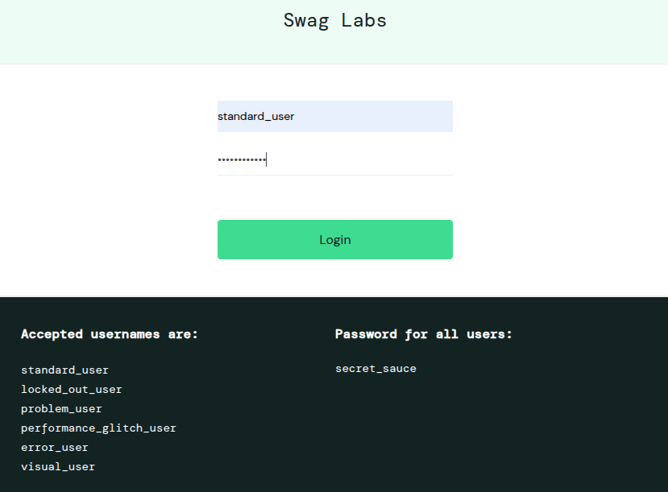
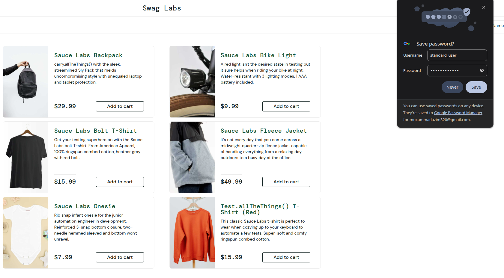
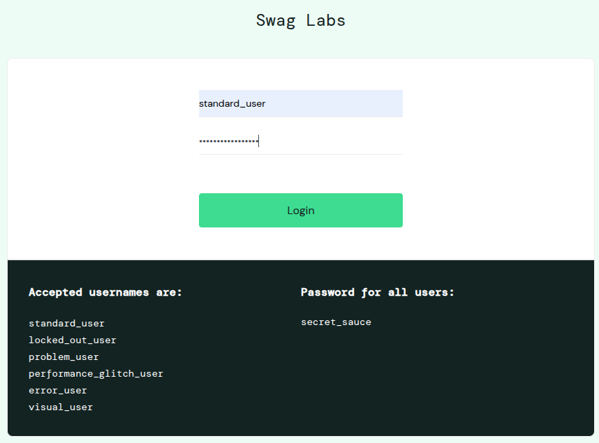
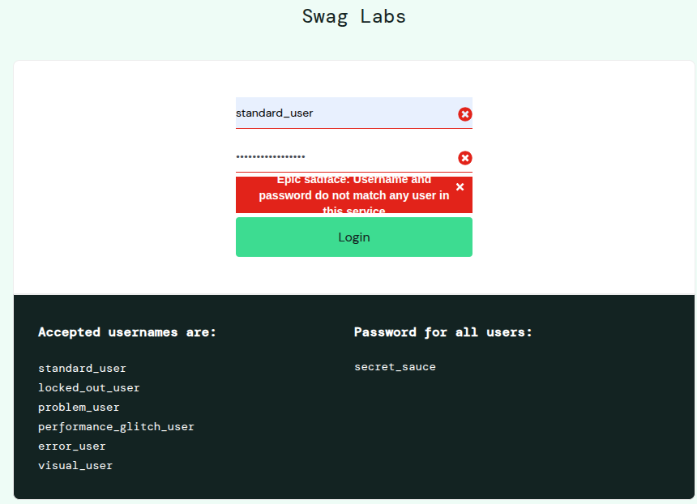

# Task 1 Login

## Positive Test Case: Succesfull Login
Test ID: TC_01
Title: Verify user authorization with valid credentials
Pre-condition: Open the browser and navigate to https://www.saucedemo.com/

Steps:
1. Locate the "Username" field and enter the valid username(s) one by one: "standard_user", "locked_out_user", "problem_user", "performance_glitch_user", "error_user", "visual_user".
2. Locate the "Password" field and enter the valid password, valid password for all users was: `secret_sauce`.
3. Click the "Login" button to submit the credentials.

Expected Result: The system successfully authenticates the user and redirects them to the Products page (`https://www.saucedemo.com/inventory.html`). The page header displays "Swag Labs" and the products list is visible.

Screenshots:

## Negative Test Case: Login with Invalid Login\Password
Test ID: TC_02
Title: Verify error message display for incorrect password
Pre-condition: Open the browser and navigate to https://www.saucedemo.com/

Steps:
1. Enter the valid username: "standard_user".
2. Enter an invalid password: "wrong_password123".
3. Click the "Login" button.

Expected Result: The system denies access and stays on the login page. A red error message is displayed: "Epic sadface: Username and password do not match any user in this service.

Screenshots:

